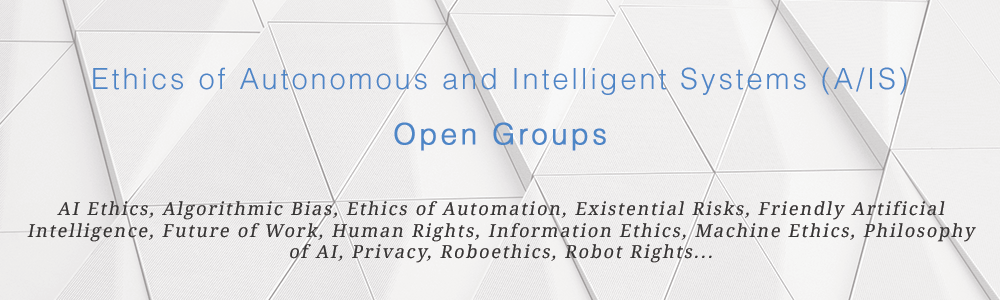

    

_**See also:
ais-ethics-open-groups |
[ais-ethics-orgs](https://github.com/fititnt/ais-ethics-orgs) |
[ais-ethics-standards](https://github.com/fititnt/ais-ethics-standards)**_

---

# A/IS Ethics Open Groups
 **Curated list of _Open_ Groups (accessible to persons who
are not yet experts and do not require association with an institution) to
discuss Ethics of Autonomous and Intelligent Systems (A/IS).** AI Ethics,
Algorithmic Bias, Ethics of Automation, Existential Risks, Friendly Artificial
Intelligence, Future of Work, Human Rights, Information Ethics, Machine Ethics,
Philosophy of AI, Privacy, Roboethics, Robot Rights...

# Open Groups

## English

### Artificial Intelligence Stack Exchange

> Artificial Intelligence Stack Exchange is a question and answer site for
people interested in AI theory, mathematics, research, discovery, design,
development, practice, embedded uses, cognition, policy, and impact. It's
built and run by you as part of the Stack Exchange network of Q&A sites. With
your help, we're working together to build a library of detailed answers to
every question about artificial intelligence.

- **Etiquete**: [Code of Conduct](https://ai.stackexchange.com/conduct) \| [Expected Behavior](https://ai.stackexchange.com/help/behavior)
- **Links:**
  - Main URL: <https://ai.stackexchange.com/>
  - Suggested tags:
    - [tag: ethics](https://ai.stackexchange.com/questions/tagged/ethics)
    - [tag: philosophy](https://ai.stackexchange.com/questions/tagged/philosophy)
    - [tag: value-alignment](https://ai.stackexchange.com/questions/tagged/value-alignment)

### EthicsNet

> EthicsNet, a non-profit, is building a community with the purpose of
co-creating examples of nice behaviours, to help socialise A.I. (...)
We want to do the same for the space of kind behaviours – a massive
collaboration efforts to construct, collate, and annotate a range of datasets
that reflect many different cultures, opinions and creeds, and which can expand
in scope and nuance over time, to empower socially-aware thinking machines for
generations to come.

- **Etiquete**: See [About EthicsNet](https://www.ethicsnet.com/about/)
- **Links:**
  - Forum: <http://forum.ethicsnet.com/>
  - Facebook Group: <https://www.facebook.com/groups/1241275855972131/>

## Non-English

_TODO: add a message about we need help around the world to promote more
non-English discussions around A/IS Ethics (fititnt, 2019-01-28 02:19 BRST)._

# Other Groups

In addition to the suggested [Open Groups](#open-groups), these links below are
potential candidates, but are not suggested by default at this time as they are
still under review (e.g. the autor of this repository is following each one).

One potential issue (that in fact was very common on references that are not
even listed here) is that some open groups related to artificial intelligence
seems to be unfriendly to non machine learning / deep learning / "how to use
this tool" discussions.

## English

### OpenAI Forum
> The OpenAI discuss forum (was) a greap place to find deeper discussions, **but
at this moment the URL is not acessible (error: ERR_NAME_NOT_RESOLVED).**

- **Links**:
  - Forum: <https://discuss.openai.com>

### Reddit: AIethics
> Discussion of how artificial intelligence agents should behave and how we
should treat them

- **Links**:
  - Reddit: <https://www.reddit.com/r/AIethics/>

### Facebook: Robot Ethics
- **Links**:
  - Facebook Group: <https://www.facebook.com/groups/47284606550/>

### Facebook: Artificial General Intelligence (AGI)
- Facebook Group: <https://www.facebook.com/groups/propBitDev/>
- Skype Group: _super_jen96_ [TODO: note to self, join this skype group]

<!--
https://www.facebook.com/groups/1241275855972131/

http://forum.ethicsnet.com/
-->

<!--
https://www.facebook.com/groups/1911980305724523/

https://www.facebook.com/groups/strongartificialintelligence/ (Group description is not very friendly, see )
-->

<!--
https://www.facebook.com/groups/propBitDev/?ref=gysj
->

<!--
Links that (for Now) will not be included

>>> Strong Artificial Intelligence (Facebook Group)
    URL: https://www.facebook.com/groups/strongartificialintelligence/
    Reason: the description of the group says:
            "A.I. critics are not allowed here and will be eliminated from
             this group. Discussing whether creating super intelligent
             machines is ethical or not is a profound waste of time."

-->

# License

To the extent possible under law, [Emerson Rocha](https://github.com/fititnt)
has waived all copyright and related or neighboring rights to this work to
[Public Domain](UNLICENSE).